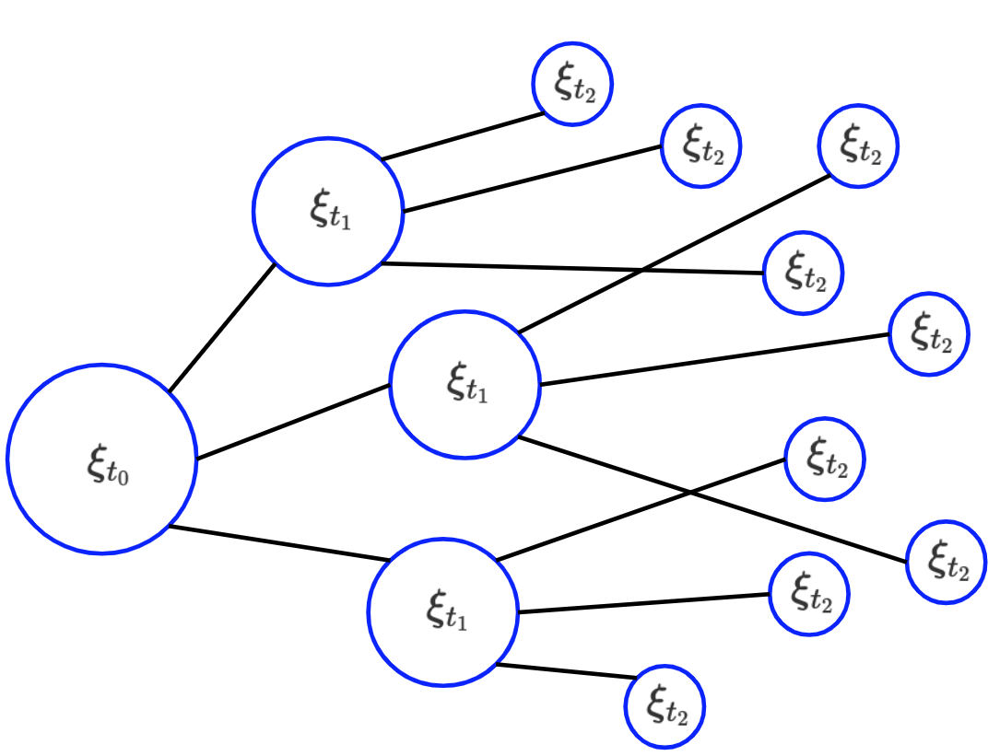
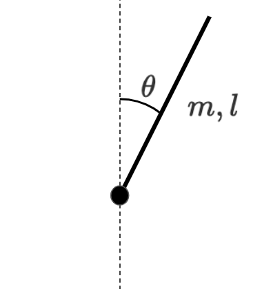

## 活動報告書

松島亮輔

### 導入
　制御とは選択の連続である。エージェント（以降、制御入力を決定する部分をエージェント、制御対象をロボットと呼ぶ）は限られた制御入力から最適と思われる入力を選択する。この世界の捉え方として、エージェントが選択を迫られる度に、選択可能な入力の数だけ異なる状態のロボットの確率的な存在の数が増えていく。このような思想をもとに新たな制御則（要調査）を模索している。

### 位相空間における表現
　物体の運動は位相空間上の粒子の運動に写像できる。ここではロボットの状態を表す位相空間上の粒子を以下のように表す。

$$
\xi = (x_i, w) \tag1
$$

ここで$x_i$は位相空間内の微小な開集合でロボットの状態、$w$は粒子の重みをそれぞれ表す。エージェントが無作為に入力を選択する世界で、ロボットを初期状態$x_0$に置いた場合の粒子は図.1のように表される。ここでは、エージェントは毎時$\Delta t$ごとに選択を迫られている。そして、エージェントに$n$個の選択肢が与えられている場合粒子の重みは、

$$
w(t_{j+1}) = w(t_j)\frac { 1 } { n } \tag 2
$$

となる。初期状態$x_0$からこのような粒子を十分な量と時間放出した状態を考えると、ある微小状態空間$x_i$内にあるもっとも重い粒子が、初期状態$x_0$から最短経路で遷移してきた粒子となる。このように、式(1)の性質を用いると二つの状態量間の入力制限を考慮した最短経路を求めることができる。

図.1　制御入力の選択肢により拡散する粒子の様子

### 連続時間における表現
　力学系におけるロボットの運動は、一般化座標$\boldsymbol p$と一般化運動量$\boldsymbol q$、制御入力$\boldsymbol u$を用いて表される。また、それぞれの時間変化は以下のように表される。

$$
\dot {\boldsymbol p} = \boldsymbol f(\boldsymbol p, \boldsymbol q, \boldsymbol u)
$$
$$
\dot {\boldsymbol q} = \boldsymbol g(\boldsymbol p, \boldsymbol q) \tag 3
$$

そして、位相空間上の粒子が流れる場の速度は

$$
\boldsymbol v(u_i) = \left[\begin{array}{c}
            {\dot {\boldsymbol p} (u_i)},
            {\dot {\boldsymbol q}}
        \end{array}\right]　\tag 4
$$

と表される。ここで、エージェントが入力を選択する行為は、流れ場$\boldsymbol v(u_i)$を選択する行為と同義である。以上を踏まえて、図.1で示した位相空間内での粒子の拡散は以下の式で表すことができる。

$$
\frac{\partial \rho}{\partial t} = \frac {1} {n}\sum_{i=1}^n -\boldsymbol v(u_i) \nabla \rho \tag 5
$$

ここで

$$
\rho = \sum_{\xi \in \mathrm{d}V} w \tag 6
$$

とし以降、$\rho$を密度と呼ぶ。また、式(5)はリウヴィルの定理を拡張した形になている。

### 仮説
　力学系の時間対称性を利用し、時間を反転させた流れ場$-\boldsymbol v(u_i)$の中で、ロボットの目標状態量$\boldsymbol x_c$に一定密度$\rho_0$を常に設定し、十分な時間をかけて拡散した場を考える。エージェントはその場の中で、もっとも密度の高い状態になるように入力を選択すると、入力が制限付きの最短時間経路になる。粒子の拡散を表す式を以下に示す。

$$
\frac{\partial \rho}{\partial t} = \frac {1} {n}\sum_{i=1}^n -(-\boldsymbol v(u_i)) \nabla \rho \tag 7
$$

ただし、$\rho(\boldsymbol x_c)=\rho_0$。

### シミュレーションにおける検証
　図.2に示すような単振り子で検証する。

図.2　単振り子

単振り子の目標状態量を頂点$x_c=[0, 0]$に設定し、式(7)に従って十分拡散した結果を図.3に示す。また、拡散シミュレーションには前進差分法を用いた。

(a)　拡散結果

(a)の密度に上限を設け低密度の部分を可視化

図.3　位相空間内に拡散した密度

図.3に基づき、

$$
u^* = \argmax_{u_i \mathrm U(x)}(\nabla \rho \cdot \boldsymbol v(u_i)) \tag 8
$$

となるような制御入力$u$を各状態量$x_i$について求めた。その結果を図.4に示す。

図.4　各状態量における制御入力

以上をもとに、初期状態$\theta_0=\pi$、$\dot \theta_0=0$に放した場合のシミュレーション結果を図.5に示す。

(a)　状態量&theta;の時間遷移

(b)　制御入力uの時間遷移

(c)　位相空間上の単振り子の状態を表す粒子の軌跡と制御入力の分布

図.5　シミュレーション結果

### 課題
シミュレーションでは単振り子は目標位置に収束下が、既存の研究にもとづいた理論の裏付けと飛躍のない理論の構築が課題と考えている。現在は、計画アリゴリズム(Steven M. LaValle, PLANNING ALGORITHMS, University of Illinois, Copyright Steven M. LaValle 2006)を参考に多様体やグラフ理論について学習している。